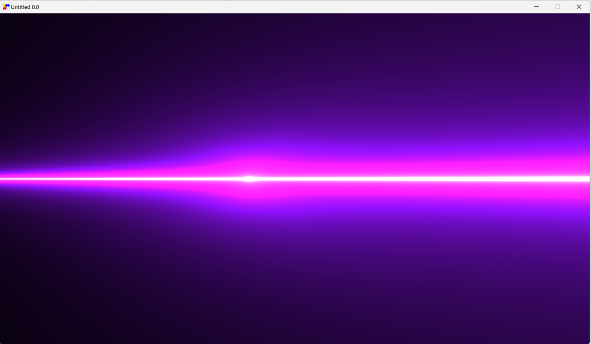

## FXGL Shader Example

This is a first draft of the API for FXGL's shader support. 

The environment requirements are:

- Windows
- JDK 23+

The native libraries for Mac/Linux will be built closer to stable release.

### Shaders to play with

[GLSLSandbox](https://glslsandbox.com/) is a decent collection of shaders to play with.
Please note that FXGL shader support is at very early stages of development, so a lot of features may not be supported.

If you discover an issue, or a missing feature, please report at https://github.com/AlmasB/FXGL by creating an issue.